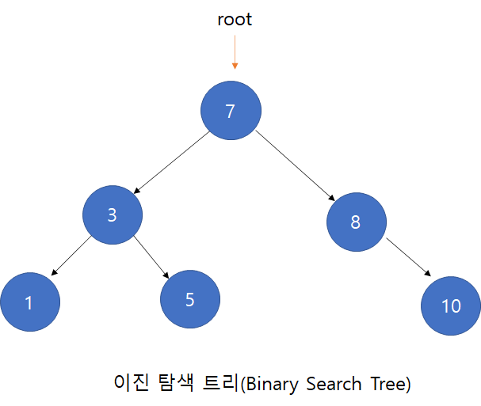
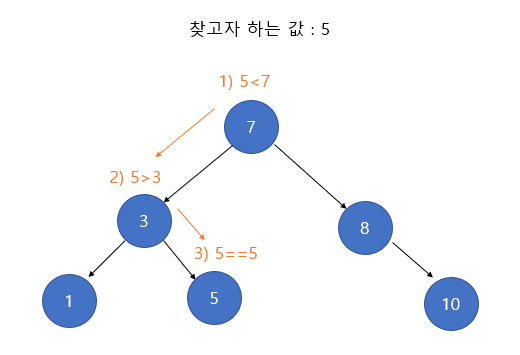

## 이진탐색트리란?
> 이진탐색트리란 다음과 같은 특징을 갖는 이진트리를 말한다.
(*이진트리 : 각 노드의 자식 노드가 2개인 트리)

1. 각 노드에 중복되지 않는 키가 있다.
2. 루트 노드의 왼쪽 서브 트리는 해당 노드의 키보다 작은 키를 갖는 노드들로 이루어져 있다.
3. 루트 노드의 오른쪽 서브 트리는 해당 노드의 키보다 큰 키를 갖는 노드들로 이루어져 있다.
4. 좌우 서브 트리도 모두 이진 탐색 트리여야 한다.

예시)

### 특징
이진탐색트리는 기존 이진트리보다 탐색 속도가 빠르다. 이진탐색트리의 탐색 연산은 높이가 h라면
O(h) 의 시간 복잡도를 갖는다.

### 탐색 과정
> 이진탐색트리의 탐색은 다음과 같은 과정을 거친다.

1. 루트 노드의 키와 찾고자 하는 값을 비교한다. 찾고자 하는 값이라면 탐색을 종료한다.
2. 찾고자 하는 값이 루트 노드의 키보다 작다면 왼쪽 서브 트리로 탐색을 진행한다.
3. 찾고자 하는 값이 루트 노드의 키보다 크다면 오른쪽 서브 트리로 탐색을 진행한다.

