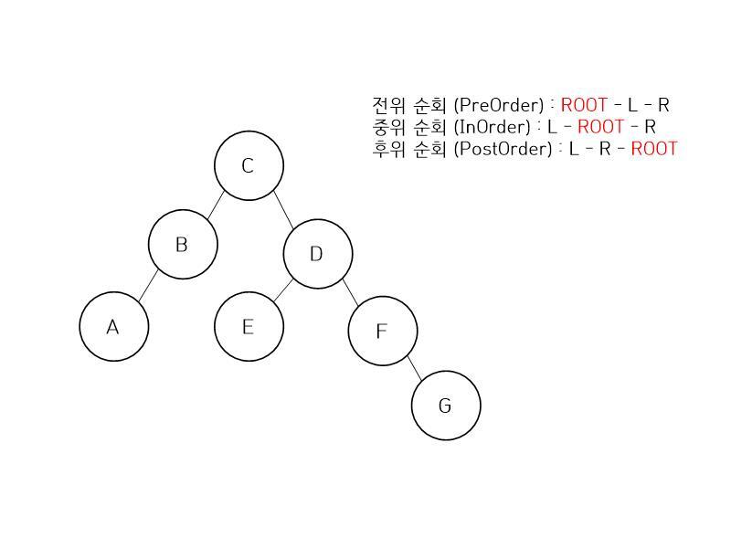
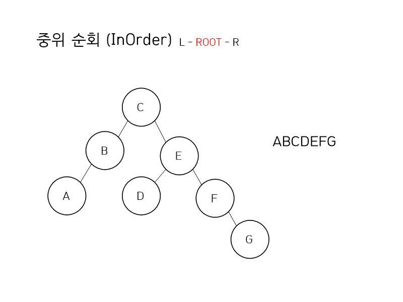
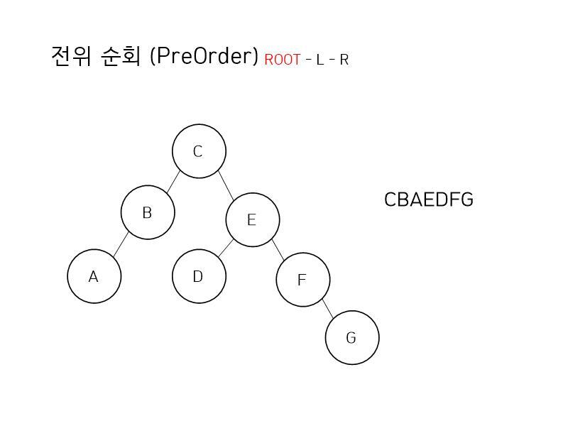
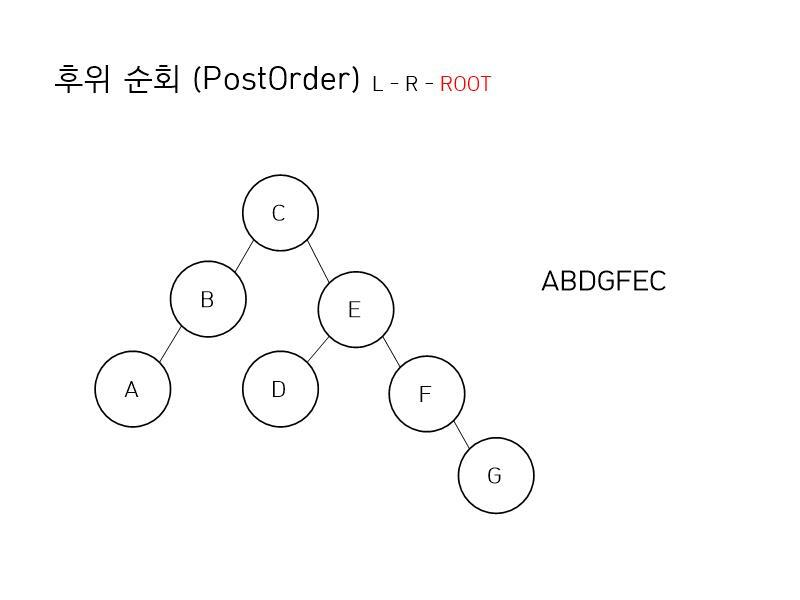

>트리에는 전위 순회(preorder), 중위 순회(inorder), 후위 순회(postorder) 가 있다.

* 순회(Iteration)란? 배열을 0부터 길이만큼 반복하는 것.



---

### java code
다음과 같은 트리 코드를 준비한다.
```java
class Node {
    int data;
    Node rightNode;
    Node leftNode;
}

class Tree {
    Node root;

    Node getRoot() {
        return root;
    }

    void setNde(int data, Node left, Node right) {
        Node node = new Node();
        node.data = data;
        node.left = left;
        node.right = right;
    }
}
```

## 중위 순회
중위 순회는 왼쪽 자식 - 루트 - 오른쪽 자식 순으로 순회한다.
아래와 같은 트리가 존재할 때 왼쪽 자식이 노드가 없을 때까지 방문하고 노드가 없다면 출력한다.


위와 같은 과정을 구현하기 위해 재귀 호출을 통해 구현할 수 있다.
```java
class example {
    public void inOrder(Node node) {

        if (node != null) {
            inOrder(node.left);
            System.out.println(node.data);
            inOrder(node.right);
        }
    }
}
```

노드가 null 이 아닐 때 까지 재귀 호출을 수행한다.

## 전위 순회
전위 순회는 루트 - 왼쪽자식 - 오른쪽 자식 순으로 순회한다.
아래와 같이 현재 노드를 출력하고 왼쪽 자식 노드 -> 오른쪽 자식 노드 순서로 방문하며 출력하는데
왼쪽 자식 노드의 자식 노드가 존재하지 않을 때 까지 아래로 계속 재귀호출한다.


```java
class example {
    public void preOrder(Node node) {
        if (node != null) {
            System.out.println(node.data);
            preOrder(node.left);
            preOrder(node.right);
            
        }
    }
}
```
노드가 null 이 아닐 떄 까지 반복하고 현재 노드를 먼저 출력한 후 왼쪽 오른쪽을 재귀호출 한다.

## 후위 순회
후위 순회는 왼쪽 자식 - 오른쪽 자식 - 루트 순으로 순회한다.
노드가 존재하지 않을 때 까지 현재 노드의 왼쪽 자식 -> 오른쪽 자식 -> 현재 노드 순으로 순회하면 된다.


```java
class example {
    public void postOrder(Node node) {
        postOrder(node.left);
        postOrder(node.right);
        System.out.println(node.data);
    }
}
```


끝으로 순회 방법은 탐색에도 정말 중요하고 dfs, bfs 와도 연계되는 부분이다.
따라서 처음부터 잘 이해하고 학습해야 할 것이다.