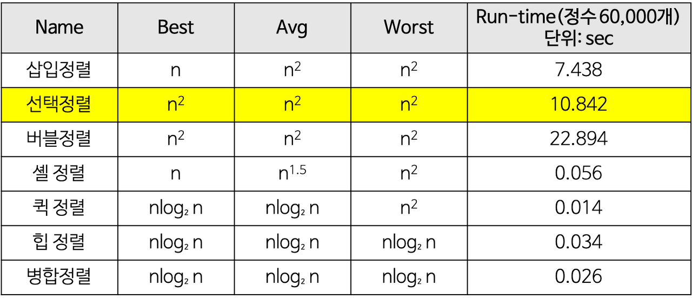

> 정렬 알고리즘은 알고리즘 중에서 기초적으로 반드시 알고 지나가야되는 파트이다. 단순히 작은 순
> 큰 순으로 순서를 정렬하는 데에도 여러가지 알고리즘이 존재하는데, 그 장단점을 알고 있어야 한다.

## 선택정렬(selection sort)
: 선택정렬은 해당 순서에 원소를 넣을 위치는 이미 정해져 있고, 그 위치에 어떤 원소를 넣을지 선택하는 알고리즘이다.
선택정렬과 삽입정렬이 종종 헷갈릴 수 있는데,
* 선택정렬은 배열에서 해당 자리를 이미 선택하고 그 자리에 오는 값을 찾는 것이며,
* 삽입정렬은 배열의 모든 요소를 앞에서부터 차례대로 이미 정렬된 배열 부분과 비교하여 자신의 위치를 찾아 삽입하는 것이다.


** 설명
1. 주어진 배열 중에서 최소값을 찾는다.
2. 그 값을 맨 앞에 위치한 값과 교체한다.
3. 맨 처음 위치를 뺀 나머지 배열을 같은 방법으로 교체한다.
4. 하나의 원소만 남을 때까지 1~3을 반복한다.

```java
class selectionSort {
    void selectionSort(int[] arr) {
        int indexMain, temp;
        for (int i = 0; i < arr.length - 1; i++) {
            indexMain = i;
            for (int j = i + 1; j < arr.length; j++) {
                if (arr[j] < arr[indexMain]) {
                    indexMain = j;
                }
            }
            temp = arr[indexMain];
            arr[indexMain] = arr[i];
            arr[i] = temp;
        }
    }
}
```

### * 시간복잡도
데이터 개수가 n개라고 했을 때,
첫 번째 회전에서 비교횟수 1~ (n-1) => n-1
두 번째 회전에서 비교횟수 2~ (n-1) => n-2
-> O(n^2)

### * 장점
1. 버블정렬과 마찬가지로 알고리즘이 단순하다.
2. 정렬을 위한 비교 횟수는 많지만, 버블정렬에 비해 실제로 교환하는 횟수는 적기 때문에 많은 교환이 일어나야 하는 자료상태에서 비교적 효율적이다.
3. 버블정렬과 마찬가지로 정렬하고자 하는 배열 안에서 교환하는 방식(제자리 정렬) 이므로, 다른 메모리 공간을 필요로 하지 않는다.

### * 단점
1. 시간복잡도가 O(n^2) 으로 비효율적이다.
2. 불안정 정렬이다.

---


* 구현 간단하지만 비효울적인 방법 : 삽입 정렬, 선택 정렬, 버블 정렬
* 복잡하지만 효율적인 방법 : 퀵, 힙, 합병, 기수