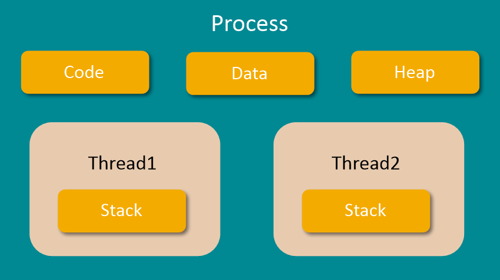

# 프로세스와 스레드

프로세스와 스레드를 이해하고 넘어가야한다.
> 프로세스란? 운영체제로부터 필요한 메모리를 할당받아 코드를 실행하고있는 프로그램이다. (하나의 어플리케이션은 2개 이상의 프로세스를 가질 수 있다.)

> 스레드란? 프로세스 내에서 실제로 작업을 수행하는 주체를 말한다. 모든 프로세스에는 한 개 이상의 스레드가 존재하여 작업을 수행한다.
>          또한 두 개 이상의 스레드를 가지는 프로세스를 멀티스레드 프로세스라 한다. 

하나의 프로세스는 크게 코드영역, 데이터영역, 스택영역, 힙영역 4가지로 이루어져 있다.
* code: 코드 자체를 구성하는 메모리 영역(프로그램 명령)
* data: 전역변수, 정적변수, 배열 등(초기화된 데이터)
* stack: 지역변수, 매개변수, 리턴 값(임시 메모리 영역)
* heap: 동적 할당 시 사용(new(), mallock() 등)

실제로 하나의 프로그램이 실행될 때, 동시에 여러 프로세스가 실행되는 경우들이 있다.(멀티 프로세스)
이 경우 실제로 cpu는 프로세스1을 어느정도 실행하고 저장하고 프로세스2를 진행하고 돌아가는 식으로
여러 프로세스를 왔가갔다하는 콘텍트 스위칭(context switching)이 일어난다.

반복이 많아지게 되면 cpu에 대한 부담이 늘어나고, 중복된 자원들이 비효율적으로 관리된다.
그럴 때 사용되는 것이 바로 멀티스레드 이다.

스레드는
1. 한 프로세스 내의 주소 공간이나 자원들을 대부분 공유한다.
2. 기본적으로 하나의 프로세스가 생성되면 하나의 스레드가 같이 생성되며, 이를 메인 스레드라고 부른다.
   스레드를 추가하지 않는 한 모든 프로그램은 메인 스레드에서 실행된다.
3. 하나의 프로세스는 여러 개의 스레드를 가질 수 있으며, 이를 멀티스레드라고 부른다.

멀티스레드를의 구조를 보면 다음과 같이 Code, Heap, Data 영역을 공유하고 있으며 Stack만 스레드별로 가지게 된다.

> 다른 자원들은 공유하지만 Stack만 분리해서 사용하는 이유는 스택 영역은 LIFO 방식이라는 특성을 가지고 있기 때문이다.
> 스택 영역은 스택이 쌓이면 위에서부터 프로세스가 섞인 채로 순서대로 나오게 되므로 더 복잡해지기 때문에 
> 원활한 실행 흐름을 위해 스택은 독립적으로 존재하게 된다.

-------

## 정리

### 멀티프로세스
: 하나의 컴퓨터에 여러 cpu를 장착해 하나 이상의 프로세스를 병렬적으롤 처리한다.
* 장점
1. 독립된 구조이므로 안정성이 높다.

* 단점
1. 각각 독립된 메모리 영역을 가지고있어, 작업량이 많을수록 오버헤드가 발생한다.
    -> Context Switching 으로 인한 성능 저하
   
### 멀티스레드
* 장점
1. 프로그램의 응답시간이 단축된다.
2. 시스템의 처리율이 향상된다.
3. 시스템의 자원 소모율이 감소된다.
4. 프로세스 간 통신 방법에 비해 스레드 간 통신 방법이 훨씬 간단하다.

* 단점
1. 여러 개의 스레드를 이용하는 경우, 미묘한 시간차나 잘못된 변수를 공유함으로서 오류 발생이 가능하다.
    -> 따라서 스레드 간에 통신할 때는 충돌 문제가 발생하지 않도록 동기화문제를 해결해야 한다.
2. 프로그램 디버깅이 어려워진다.
3. 단일 프로세스 시스템에서는 효과를 기대하기 어렵다.
    
